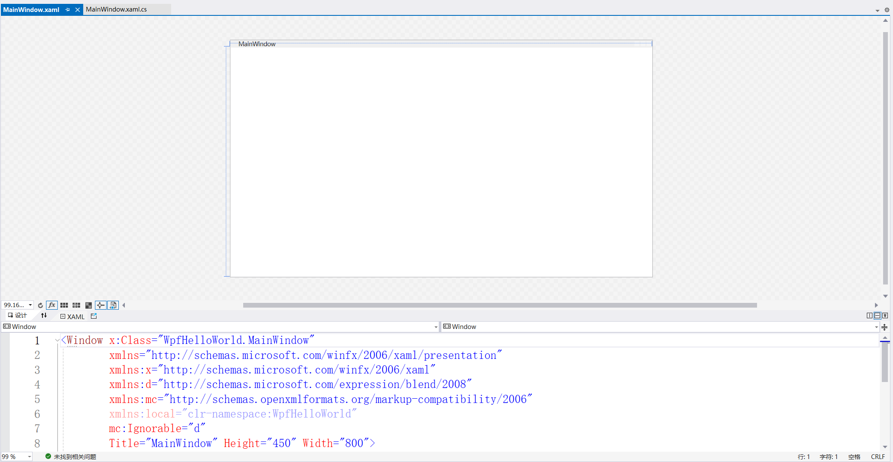
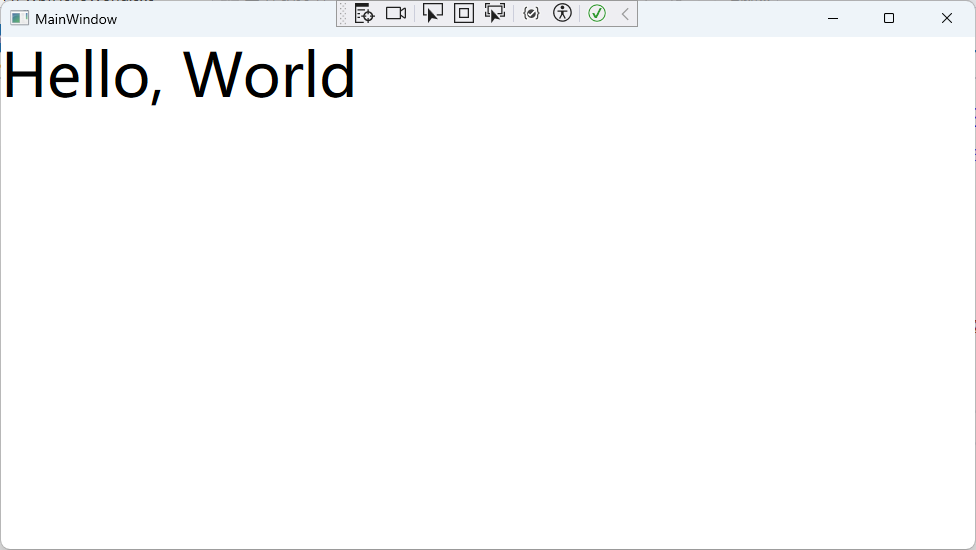
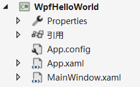
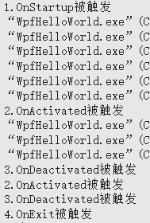
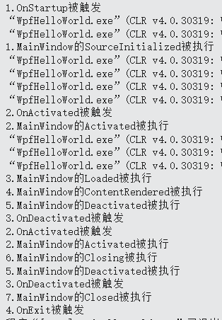
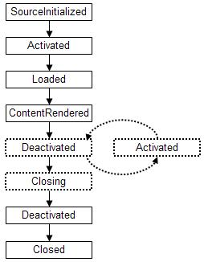
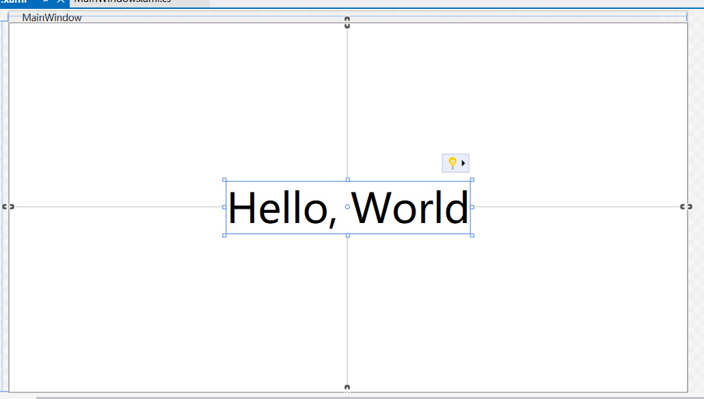
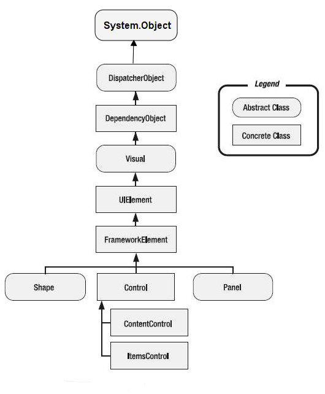
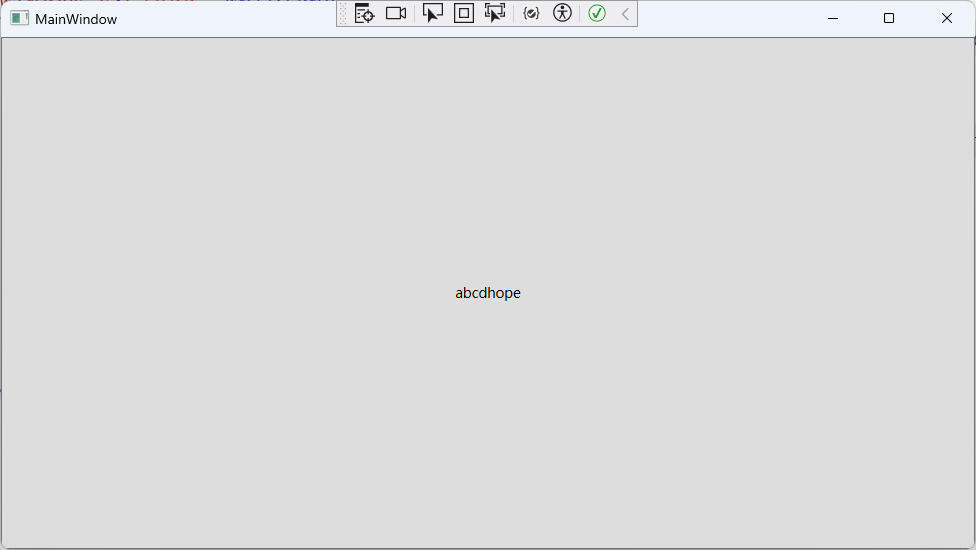

# 前言

目前以[WPF中文网](https://www.wpfsoft.com/introduction)作为教程来学习WPF。

先选择.net framework作为框架。

# HelloWorld

经典HelloWorld开局，创建WPF后界面如下：



下方为XAML代码，用来改变界面的，例如在Grid中增加一个`<TextBlock>`

标签，标签中输入Hello, World。

```xaml
<Window x:Class="WpfHelloWorld.MainWindow"
        xmlns="http://schemas.microsoft.com/winfx/2006/xaml/presentation"
        xmlns:x="http://schemas.microsoft.com/winfx/2006/xaml"
        xmlns:d="http://schemas.microsoft.com/expression/blend/2008"
        xmlns:mc="http://schemas.openxmlformats.org/markup-compatibility/2006"
        xmlns:local="clr-namespace:WpfHelloWorld"
        mc:Ignorable="d"
        Title="MainWindow" Height="450" Width="800">
    <Grid>
        <TextBlock Text="Hello, World" FontSize="48"></TextBlock>
    </Grid>
</Window>
```

界面显示结果如下：



该程序中主要包括以下文件：



其中，`MainWindow.xaml`为主窗体，其代码由上面的代码组成。

`App.xaml`最为重要，其代表着当前应用程序本身，由于一个程序可能包含多个窗体，那么`App.xaml`的作用就是如何调用这些窗体。

## App.xaml

xaml类型的文件包含两部分：`.xaml`前端代码和`.xaml.cs`后端代码。

app.xaml的前端代码如下：

```xaml
<Application x:Class="WpfHelloWorld.App"
             xmlns="http://schemas.microsoft.com/winfx/2006/xaml/presentation"
             				xmlns:x="http://schemas.microsoft.com/winfx/2006/xaml"
             xmlns:local="clr-namespace:WpfHelloWorld"
             StartupUri="MainWindow.xaml">
    <Application.Resources>
         
    </Application.Resources>
</Application>
```

后端代码如下：

```c#
using System;
using System.Collections.Generic;
using System.Configuration;
using System.Data;
using System.Linq;
using System.Threading.Tasks;
using System.Windows;

namespace WpfHelloWorld
{
    /// <summary>
    /// App.xaml 的交互逻辑
    /// </summary>
    public partial class App : Application
    {
    }
}
```

从后端代码中的结构来看，其由C#来编写，其中内部定义了一个局部类`App`，该类继承Application。

局部类的一部分定义在这个文件中，而另一部分则定义在前端代码中：

```xaml
<Application x:Class="WpfHelloWorld.App"
</Application> 
```

这句话的意思是定义了一个名叫App的类，该类位于命令空间WpfHelloWorld，`x:Class`可等价于c#中的`class`。

App类继承于Application类，其部分代码如下：

```c#
namespace System.Windows
{
    //
    // 摘要:
    //     封装 Windows Presentation Foundation (WPF) 应用程序。
    public class Application : DispatcherObject, IHaveResources, IQueryAmbient
    {
        [SecurityCritical]
        public Application();
        //获取或设置 System.Reflection.Assembly 提供包 统一资源标识符 (URI) 中的资源 WPF 应用程序。        
        public static Assembly ResourceAssembly { get; set; }
 
        //获取 System.Windows.Application 当前对象 System.AppDomain。
        public static Application Current { get; }
 
        //获取应用程序中实例化的窗口。
        public WindowCollection Windows { get; }
 
        //获取或设置该应用程序的主窗口。
        public Window MainWindow { get; set; }
 
        //获取或设置导致的情况， System.Windows.Application.Shutdown 来调用方法。
        public ShutdownMode ShutdownMode { get; set; }
 
        //获取或设置应用程序范围的资源，如样式和画笔的集合。
        [Ambient]
        public ResourceDictionary Resources { get; set; }
 
        //获取或设置 UI 一个应用程序启动时自动显示。
        public Uri StartupUri { get; set; }
 
        //获取应用程序作用域属性的集合。
        public IDictionary Properties { get; }
 
        
        public event EventHandler Deactivated;
        public event SessionEndingCancelEventHandler SessionEnding;
        public event DispatcherUnhandledExceptionEventHandler DispatcherUnhandledException;
        public event NavigatingCancelEventHandler Navigating;
        public event NavigatedEventHandler Navigated;
        public event NavigationProgressEventHandler NavigationProgress;
        public event NavigationFailedEventHandler NavigationFailed;
        public event LoadCompletedEventHandler LoadCompleted;
        public event EventHandler Activated;
        public event NavigationStoppedEventHandler NavigationStopped;
        public event FragmentNavigationEventHandler FragmentNavigation;
 
        public static StreamResourceInfo GetContentStream(Uri uriContent);
        public static string GetCookie(Uri uri);
        public static StreamResourceInfo GetRemoteStream(Uri uriRemote);
        public static StreamResourceInfo GetResourceStream(Uri uriResource);
        public static object LoadComponent(Uri resourceLocator);
        public static void LoadComponent(object component, Uri resourceLocator);
        public static void SetCookie(Uri uri, string value);
        public object FindResource(object resourceKey);
        public int Run(Window window);
        public int Run();
        public void Shutdown();
        public void Shutdown(int exitCode);
        public object TryFindResource(object resourceKey);
        protected virtual void OnActivated(EventArgs e);
        protected virtual void OnDeactivated(EventArgs e);
        protected virtual void OnExit(ExitEventArgs e);
        protected virtual void OnFragmentNavigation(FragmentNavigationEventArgs e);
        protected virtual void OnLoadCompleted(NavigationEventArgs e);
        protected virtual void OnNavigated(NavigationEventArgs e);
        protected virtual void OnNavigating(NavigatingCancelEventArgs e);
        protected virtual void OnNavigationFailed(NavigationFailedEventArgs e);
        protected virtual void OnNavigationProgress(NavigationProgressEventArgs e);
        protected virtual void OnNavigationStopped(NavigationEventArgs e);
        protected virtual void OnSessionEnding(SessionEndingCancelEventArgs e);
        protected virtual void OnStartup(StartupEventArgs e);
 
    }
}
```

从代码中来看，貌似是对WPF程序的控制，例如MainWindow像是设置主窗体，Shutdown对程序停止，StartupUri可以指定程序第一次启动时显示的界面。

Application类继承于DispatcherObject父类，DispatcherObject是WPF的最终抽象基类。

## Application的生命周期

软件的生命周期，指启动软件到关闭软件的整个过程。

从上一节得知App类继承Application，那么可以重写一些方法，现在重写`OnActivated`、`OnStartup`、`OnDeactivated`、`OnExit`这几个方法：

```c#
namespace WpfHelloWorld
{
    /// <summary>
    /// App.xaml 的交互逻辑
    /// </summary>
    public partial class App : Application
    {
        protected override void OnStartup(StartupEventArgs e)
        {
            base.OnStartup(e);
            Console.WriteLine("1.OnStartup被触发");
        }
        protected override void OnActivated(EventArgs e)
        {
            base.OnActivated(e);
            Console.WriteLine("2.OnActivated被触发");
        }
        protected override void OnDeactivated(EventArgs e)
        {
            base.OnDeactivated(e);
            Console.WriteLine("3.OnDeactivated被触发");
        }
        protected override void OnExit(ExitEventArgs e)
        {
            base.OnExit(e);
            Console.WriteLine("4.OnExit被触发");
        }
    }
}
```

现在按顺序执行下列操作：启动程序、隐藏程序、打开程序、关闭程序。这时代码运行的结果为：



可以看到启动程序时自动调用`OnStartup`和`OnActivated`，隐藏程序时`OnDeactivated`，打开程序时`OnActivated`，关闭程序时`OnDeactivated`和`OnExit`，这是由于`OnActivated`表示激活程序时，而`OnDeactivated`表示激活状态转换为非激活状态。

由此得知，Application即程序的生命周期为:OnStartup->OnActivated->OnDeactivated->OnExit.

## Window窗体的生命周期

目前只创建了一个窗体即主窗体，实际上一个应用实例可以创建多个窗体。

现在在主窗体的构造函数中写下如下代码来观察主窗体和应用程序的调用顺序：

```c#
namespace WpfHelloWorld
{
    /// <summary>
    /// MainWindow.xaml 的交互逻辑
    /// </summary>
    public partial class MainWindow : Window
    {
        public MainWindow()
        {
            InitializeComponent();
            this.SourceInitialized += (s, e) => Console.WriteLine("1.MainWindow的SourceInitialized被执行");

            this.Activated += (s, e) => Console.WriteLine("2.MainWindow的Activated被执行");

            this.Loaded += (s, e) => Console.WriteLine("3.MainWindow的Loaded被执行");

            this.ContentRendered += (s, e) => Console.WriteLine("4.MainWindow的ContentRendered被执行");

            this.Deactivated += (s, e) => Console.WriteLine("5.MainWindow的Deactivated被执行");

            this.Closing += (s, e) => Console.WriteLine("6.MainWindow的Closing被执行");

            this.Closed += (s, e) => Console.WriteLine("7.MainWindow的Closed被执行");

            this.Unloaded += (s, e) => Console.WriteLine("8.MainWindow的Unloaded被执行");
        }
    }
}
```

运行结果如下：



其中，主窗体触发的事件含义为：

| 方法              | 含义                                           |
| ----------------- | ---------------------------------------------- |
| SourceInitialized | 创建窗体源时引发此事件                         |
| Activated         | 当前窗体成为前台窗体时引发此事件               |
| Loaded            | 当前窗体内部所有元素完成布局和呈现时引发此事件 |
| ContentRendered   | 当前窗体的内容呈现之后引发此事件               |
| Closing           | 当前窗体关闭之前引发此事件                     |
| Deactivated       | 当前窗体成为后台窗体时引发此事件               |
| Closed            | 当前窗体关闭之后引发此事件                     |
| Unloaded          | 当前窗体从元素树中删除时引发此事件             |

从运行结果可以得知：

窗体的运行周期为：



并且可以看到：应用程序开启后先调用本身的启动方法再调用窗体的启动方法，同时激活时也是程序优先激活，而转为非激活状态时窗体先于程序，关闭时也是窗体先关闭。有点类似于基类和派生类的构造函数和析构函数的调用，先是调用基类的构造函数再调用派生类，而结束时先调用派生类的析构函数。

## Window窗体的组成

窗体本质上是一个控件，但它具有Closing和Closed事件，而一般控件没有关闭功能。

窗体分为工作区和非工作区。工作区就是放置控件的区域，也就是中间部分，而非工作区就是外框部分例如图标、标题、最大最小按钮等。

例如之前的xaml代码中:

```xaml
<Window x:Class="WpfHelloWorld.MainWindow"
        xmlns="http://schemas.microsoft.com/winfx/2006/xaml/presentation"
        xmlns:x="http://schemas.microsoft.com/winfx/2006/xaml"
        xmlns:d="http://schemas.microsoft.com/expression/blend/2008"
        xmlns:mc="http://schemas.openxmlformats.org/markup-compatibility/2006"
        xmlns:local="clr-namespace:WpfHelloWorld"
        mc:Ignorable="d"
        Title="MainWindow" Height="450" Width="800">
    <Grid>
        <TextBlock Text="Hello, World" FontSize="48" HorizontalAlignment="Center" VerticalAlignment="Center"></TextBlock>
    </Grid>
</Window>
```

该代码表示为在窗体中心放置一个`TextBlock`控件:



窗体的工作区本质是Window类的Content属性（在基类ContentControl中），该属性类型为object，只接受一个对象，因此默认的`<Window></Window>`之中只能存在一个控件。为了能够放置多个控件，可以在控件中放置控件，例如上例中在Grid控件中放置TextBlock文字块控件。

# 控件父类

大多数控件都继承于下列几个父类：



## DispatcherObject类

.net为WPF准备了两个线程：UI线程与后台线程。UI线程用于界面操作例如鼠标点击、界面更新等，而后台线程用于计算、文件读写等操作。

若后台线程要访问UI线程的控件，则可以通过DispatcherObject类的`Dispatcher`成员的两个方法：Invoke和BeginInvoke。Invoke 是同步的， BeginInvoke 是异步的。

例如添加一个按钮，然后创建一个子线程来调用按钮的Invoke方法：

```c#
// 后台程序
public partial class MainWindow : Window
{
    public MainWindow()
    {
        InitializeComponent();
        Task.Factory.StartNew(() =>
        {
            Task.Delay(2000).Wait();
            button1.Dispatcher.Invoke(() =>
            {
                button1.Content = "abcdhope";
            });
        });
    }
}

```

```xaml
 <!-- 前台代码 -->
<Window x:Class="WpfDispatcher.MainWindow"
        xmlns="http://schemas.microsoft.com/winfx/2006/xaml/presentation"
        xmlns:x="http://schemas.microsoft.com/winfx/2006/xaml"
        xmlns:d="http://schemas.microsoft.com/expression/blend/2008"
        xmlns:mc="http://schemas.openxmlformats.org/markup-compatibility/2006"
        xmlns:local="clr-namespace:WpfDispatcher"
        mc:Ignorable="d"
        Title="MainWindow" Height="450" Width="800">
    <Grid>
        <Button x:Name="button1"/>
    </Grid>
</Window>
```

后台代码的意思是：创建一个子线程并创建匿名函数，匿名函数中首先等待两秒，然后执行button控件的invoke方法，方法内又调用一个匿名函数将控件的内容修改为abcdhope。



## DependencyObject类

在winform中，改变一个控件的值通常采用以下方法：

```c#
button1.Text = "确定";
```

这种方法叫做`事件驱动模式`。每当需要更新的时候直接进行赋值。

而还有一种模式即数据驱动模式，这种模式通过其他变量的更新来更新控件的值。

DependencyObject类通过`GetValue`和`SetValue`来获取与设置属性的值，其中`GetValue`返回object值，`SetValue`的第一个参数为需要设置的属性，第二个为设置的值。

```c#
public class DependencyObject : DispatcherObject
{
    public DependencyObject();
 
    public DependencyObjectType DependencyObjectType { get; }
    public bool IsSealed { get; }
 
    public void ClearValue(DependencyProperty dp);
    public void ClearValue(DependencyPropertyKey key);
    public void CoerceValue(DependencyProperty dp);
    public sealed override bool Equals(object obj);
    public sealed override int GetHashCode();
    public LocalValueEnumerator GetLocalValueEnumerator();
    public object GetValue(DependencyProperty dp);
    public void InvalidateProperty(DependencyProperty dp);
    public object ReadLocalValue(DependencyProperty dp);
    public void SetCurrentValue(DependencyProperty dp, object value);
    public void SetValue(DependencyProperty dp, object value);
    public void SetValue(DependencyPropertyKey key, object value);
    protected virtual void OnPropertyChanged(DependencyPropertyChangedEventArgs e);
    protected internal virtual bool ShouldSerializeProperty(DependencyProperty dp);
 
}
```

## Visual类

visual类用于对界面的呈现：

输出显示：呈现视觉对象的持久、序列化的绘图内容。
转换：针对**视觉对象**执行转换。
剪裁：为视觉对象提供**剪裁**区域支持。
命中测试：确定坐标或几何形状是否包含在视觉对象的边界内。
边框计算：确定视觉对象的**边框**。

控件能够使用的方法成员有：

- DependencyObject **FindCommonVisualAncestor**(DependencyObject otherVisual); //返回两个可视对象的公共上级。
- bool **IsAncestorOf**(DependencyObject descendant); //确定可视对象是否为后代可视对象的上级。
- bool **IsDescendantOf**(DependencyObject ancestor); //确定可视对象是否为上级可视对象的后代。
- Point **PointFromScreen**(Point point); //将屏幕坐标中的 Point 转换为表示 Point 的当前坐标系的 Visual。
- Point **PointToScreen**(Point point); //将表示 Point 的当前坐标系的 Visual 转换为屏幕坐标中的 Point。
- GeneralTransform2DTo3D **TransformToAncestor**(Visual3D ancestor); //返回一个转换，该转换可用于将 Visual 中的坐标转换为可视对象的指定 Visual3D 上级。
- GeneralTransform **TransformToAncestor**(Visual ancestor); //返回一个转换，该转换可用于将 Visual 中的坐标转换为可视对象的指定 Visual 上级。
- GeneralTransform **TransformToDescendant**(Visual descendant); //返回一个转换，该转换可用于将 Visual 中的坐标转换为指定的可视对象后代。
- GeneralTransform **TransformToVisual**(Visual visual); //返回一个转换，该转换可用于将 Visual 中的坐标转换为指定的可视对象。

从上面几个方法中来看有点抽象，大多数都是将坐标进行转换，看起来像是对布局进行绘制，例如创建一个布局控件，然后在布局中创建子控件，Visual类负责将控件的位置进行转换。
